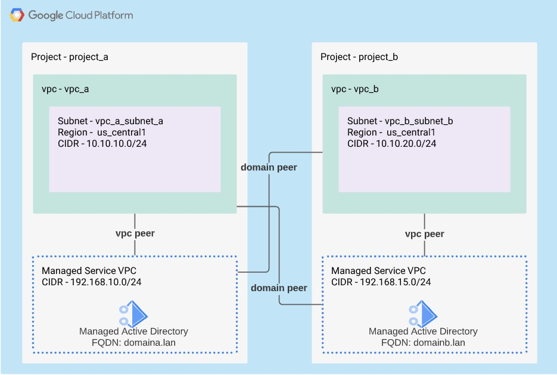

# Managed AD with Domain Peering Example

## Overview

This terraform configuration will automate the deployment of the architecture that is depicted below into 2 existing projects. Please review the variables.tf file to update any variables that have default values.

This example will demonstrate the abuility to automate the deployment of Managed Active Directory as well as show how to enable access to Managed Active Directory services in different projects and VPCs through the use of [Domain Peering](https://cloud.google.com/managed-microsoft-ad/docs/domain-peering)

## Requirements

### If deploying into 2 GCP accounts the following steps must be completed in both.
- [Google Cloud SDK](https://cloud.google.com/sdk/docs/install) - Installed by default in CloudShell
- Enabled Applicable APIs
  - [Compute Engine API](https://console.cloud.google.com/marketplace/product/google/compute.googleapis.com)
  - [Managed Service for Microsoft Active Directory API](https://console.cloud.google.com/apis/library/managedidentities.googleapis.com)
  - [Cloud DNS API](https://console.cloud.google.com/apis/library/dns.googleapis.com)
  - Billing Account Associated to projects - see [Confirm Billing is Enabled](https://cloud.google.com/billing/docs/how-to/modify-project#confirm_billing_is_enabled_on_a_project)

## Limits

- [Managed AD Domain Peering Limits](https://cloud.google.com/managed-microsoft-ad/docs/domain-peering#how_peering_differs_from_authorized_network_in_domain)

## Deployment Steps
1. Login to GCP Console and launch CloudShell

2. Clone git repo.

~~~~
git clone https://github.com/hoogman/gcp-terraform-examples.git
~~~~

3. Change directory to the terraform_managed_ad_peering directory.

~~~~
cd gcp-terraform-examples/terraform_managed_ad_peering
~~~~

4. Initialize terraform confit

~~~~
terraform init
~~~~

5. Execute terraform plan and correct any errors.

~~~~
terraform plan
~~~~

6. Deploy configuration.

   ##### Notice - When running the below command you will be prompted to enter the GCP Project IDs that you will be using to deploy resources. If you with to only use a single project then enter the same project ID twice.

   ##### *Managed AD Service deployment can take 30-45 min to complete.*

~~~~
terraform apply
~~~~

## Removal Steps

1. Execute the following to remove configuration.

~~~~
terraform destroy
~~~~

## Additional Information

### See variables.tf file is you with to view or override existing default variable values.